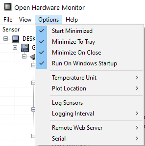

# monitor_hw_display

Monitor de Hardware Arduino utilizando OpenHardware Monitor y algunos script los cuales se ejecutan con una tarea programada en windows.

<strong>Requisitos:</strong>

<ul>
	<li>PHP 7.x o superior</li>
	<li>Arduino Uno o algun otro modelo compatible</li>
	<li>Placa de circuitos o protoboard</li>
	<li>Display LED 8x8 (la cantidad que el usuario quiera)</li>
	<li>Cables con pines</li>
</ul>

<strong>Configuración:</strong>

<h3>1.- Configurar OpenHardware Monitor</h3>

Primero se debe configurar el software para que este se inicie junto con Windows. Marcar las opciones que aparecen en la imagen.

Despues ahi que activar el servidor remotor del programa. La URL de este es <strong>localhost:8085</strong>

<h3>2.- Armar el circuito</h3>

Armarlo como se ve en la imagen

<h4>Pines</h4>

<ul>
	<li>VCC -> 5V (cable rojo)</li>
	<li>GND -> GND (cable negro)</li>
	<li>DIN -> Pin 7 (digital, cable naranjo)</li>
	<li>CS -> Pin 5 (digital, cable azul)</li>
	<li>CLK -> Pin 6 (digital, cable verde)</li>
</ul>

En el esquema aparecen 6 pines en la matriz led pero en realidad son 5 por lo que no se debe tomar en cuenta el que esta libre en la imagen. Se deben conectar siempre de derecha a izquierda.

<h3>3.- Modificar el codigo (opcional)</h3>

<h4>3.1 Para arduino</h4>

Esto es solo para cambiar la cantidad de matrices a usar modificar solo el valor de "#define NUM_OF_MATRIX 3". En este caso tiene 3. Si desean modificar otra parte del código obviamente son libre de hacerlo.

<h4>3.2 Para el script</h4>

<code>
	exec("C:\Windows\System32\mode.com COM3 BAUD=9600 PARITY=N data=8 stop=1 xon=off");
	$fp = fopen("com3", "w");
</code>

En las lineas anterior se debe cambiar el <strong>COM3</strong> por el puerto que esté utilizando el arduino

<h3>4.- Crear Tarea Programada</h3>

Ir al Programador de Tareas de Windows y hacer click en <strong>Crear tarea básica</strong>

Escoger el nombre que deseen y siguiente.

Escoger la opción <strong>Al iniciar sesión</strong> y siguiente.

Escoger la opción <strong>Iniciar un programa</strong> y siguiente.

Presionar el boton Examinar y buscar dentro de la carpeta el archivo <strong>script_sin_ventana.vbs</strong> y siguiente. En el siguiente paso hace click en finalizar.

Después ir a la tarea creada y hacer click en propiedades. En pestaña desencadenadores editar la opción <strong>Al iniciar la sesión</strong> y desactivar la opción <strong>Repetir cada</strong> y agregar un nuevo desencadenador.

En <strong>Iniciar la tarea</strong> seleccionar la opción <strong>Según una programación</strong>. Marcar la opción <strong>Repetir cada</strong> y escribir en el campo de la derecha <strong>1 minuto</strong> y en el campo <strong>durante</strong> seleccionar la opción <strong>Indefinidamente</strong>.

Finalmente guardar los cambios y hacer click en iniciar para que la tarea comience a funcionar.

